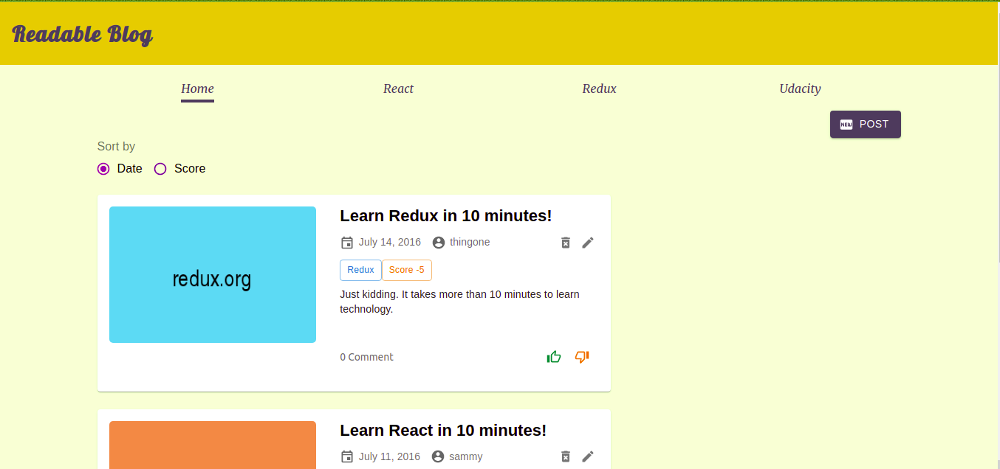

# Readable Blog Project

This is a project for the final assessment project for Udacity's Redux course where users will be able to add content and comment. Users will be able to post content to predefined categories, comment on their posts and other users' posts, and vote on posts and comments. Users will also be able to edit and delete posts and comments.

## Built With:

- React
- Redux
- React Router V6
- Express
- Node
- Material-UI
- Styled Components

## Live Demo:

[ReactND - Readable Blog](https://readable-blog.vercel.app/)

## Getting Started

To get started locally on your PC, run the following commands in the terminal:

- Install Dependencies and start the server

* `open your terminal`
* `yarn dev` to run the development build concurrently
* `yarn dev` starts both the frontend and server and displays the frontend on `localhost:3000` and backend on `localhost:3001`

## Author

👤️ Isaiah Abiodun

- [Github](https://github.com/abisalde)
- [LinkedIn](https://www.linkedin.com/in/abisalde/)
- [Twitter](https://twitter.com/abisalde)

## 🤝️ Contributing

Contributions are welcome! Please open an issue or pull request on Github.

## Acknoledgements

- [Udacity](https://www.udacity.com/)
- [React.js](https://reactjs.org/)
  - [Redux](https://redux.js.org/)
  - [React Router](https://reacttraining.com/react-router/)

## Show your support

If you like this project, please show your support by starring ⭐️ the project on Github.
